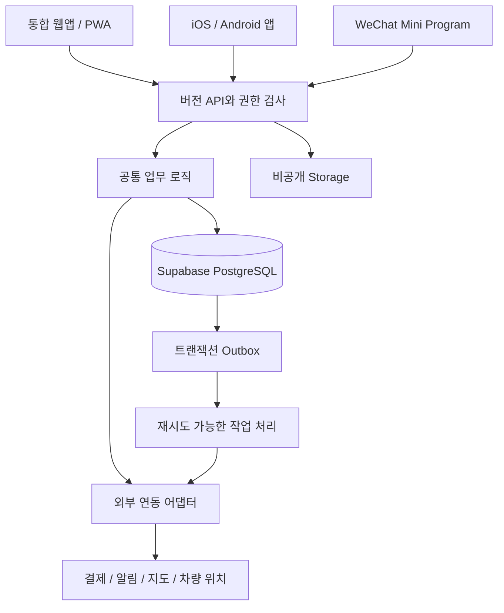

# 04. 시스템 아키텍처·API·외부 연동

연결: [메인](../AGENTS.md), [데이터](05-data-auth-security.md), [결제](06-booking-payments-settlement.md)

## 1. 구조 결정

초기에는 하나의 웹 배포와 모듈화된 서버 로직을 사용한다. 기능마다 독립 서버를 만들지 않는다. Next.js는 웹 렌더링과 API 진입점, Supabase는 PostgreSQL·인증·비공개 파일·권한 기반 실시간 갱신을 담당한다.



웹 전용 Server Actions를 쓸 수 있지만 핵심 업무는 공통 함수와 버전 API를 통해 재사용 가능해야 한다. 모바일·미니프로그램이 웹 서버 내부 동작을 흉내 내도록 만들지 않는다.

## 2. 실행 환경

| 환경 | 데이터 | 외부 호출 | 목적 |
|---|---|---|---|
| local | 로컬 Supabase·합성 시드 | mock 기본 | 개발·자동 테스트 |
| preview | 격리된 개발 프로젝트/브랜치 | mock 또는 승인된 sandbox | 변경 검토 |
| staging | 별도 검증 프로젝트 | sandbox·시험 계정 | 통합·기기 검증 |
| production | 운영 프로젝트 | 검증된 live | 실제 고객 서비스 |

Supabase는 서울 리전을 우선 선택하고 API 실행 지역도 데이터베이스와 가까운 지원 지역으로 맞춘다. 리전 선택만으로 중국 접속 품질을 보장하지 않는다. Vercel 프리뷰가 운영 DB에 연결되지 않도록 환경별 비밀값·연결 대상 검사를 둔다.

기본 설정 키 예시: `APP_ENV`, `APP_URL`, `SUPABASE_URL`, `SUPABASE_PUBLISHABLE_KEY`, `SUPABASE_SERVER_SECRET`, `PAYMENT_MODE`, `PAYMENT_PROVIDER`, `PAYMENT_MERCHANT_ID`, `PAYMENT_SECRET`, `PAYMENT_WEBHOOK_SECRET`, `NOTIFICATION_MODE`, `WECHAT_APP_ID`, `WECHAT_APP_SECRET`, `CRON_SECRET`. 이름은 구현에서 공급사 SDK와 맞춰 확정하되 비밀값에는 `NEXT_PUBLIC_`을 붙이지 않는다.

`production`에서 mock 결제가 활성화되면 배포 검사 실패 또는 해당 결제수단 비활성. 개발 화면은 테스트 모드 표식을 표시한다. 설정값 존재와 실제 연결 검증 여부는 별개 필드로 관리한다.

## 3. API 공통 계약

- 접두어 `/api/v1`.
- 요청 스키마를 서버에서 검증하고 응답은 명시적인 DTO로 직렬화한다. DB 행 전체 반환 금지.
- 요청별 `requestId`, 변경 요청별 `Idempotency-Key` 사용.
- 금액·상태 변경은 클라이언트 전달값을 신뢰하지 않고 서버 데이터와 비교한다.
- 웹 세션 쿠키에는 Secure·HttpOnly·적합한 SameSite 정책. 변경 요청의 Origin·CSRF 방어를 적용한다.
- 앱·미니프로그램은 짧은 접근 토큰과 안전한 갱신 흐름을 별도 구현한다. 웹 쿠키 흐름을 무조건 재사용하지 않는다.
- 인증 후에도 주문·호텔·배정 작업별 객체 권한을 검사한다.
- 목록은 cursor 페이지네이션, 최대 페이지 크기, 필터 허용목록을 사용한다.

```json
{
  "data": { "orderId": "uuid", "reservationStatus": "confirmed" },
  "meta": { "requestId": "uuid", "serverTime": "2026-09-29T01:00:00Z" }
}
```

```json
{
  "error": {
    "code": "CAPACITY_UNAVAILABLE",
    "messageKey": "booking.slotUnavailable",
    "fieldErrors": { "slotId": "booking.chooseAnotherSlot" },
    "retryable": false
  },
  "meta": { "requestId": "uuid" }
}
```

400 입력 오류, 401 세션 필요, 403 권한 없음, 404 접근 가능한 대상 없음, 409 상태·중복 키 충돌, 422 업무 규칙 불가, 429 제한, 503 공급사 일시 장애를 구분한다. 내부 예외·SQL·토큰을 고객에게 반환하지 않는다.

## 4. 핵심 엔드포인트

| 메서드·경로 | 목적 | 권한·멱등성 |
|---|---|---|
| GET `/hotels`, `/service-slots` | 가능 호텔·슬롯 | 공개, 제한된 DTO |
| POST `/quotes` | 서버 견적 | guest/회원, rate limit |
| POST `/orders` | 견적 검증·홀드·주문 | 소유 세션, 멱등 |
| GET `/orders/{id}` | 주문 현재 상태 | 소유자/권한 있는 업무자 |
| POST `/orders/{id}/payment-attempts` | PG 결제 세션 | 소유자, 멱등 |
| POST `/payments/webhooks/{provider}` | 공급사 결과 수신 | 서명 검증, 이벤트 중복 제거 |
| POST `/orders/{id}/cancellation-requests` | 취소 요청 | 소유자, 멱등 |
| POST `/refunds/{id}/approve` | 환불 승인 | finance 권한, 멱등 |
| POST `/uploads/intents` | 제한된 업로드 권한 | 파일 목적·대상 권한 |
| POST `/bags/{id}/events` | 수거·인계·예외 | 배정 업무자, 버전·멱등 |
| POST `/orders/{id}/handoff-challenges` | 수령 코드 발급 | 소유자, rate limit |
| POST `/handoffs/verify` | 수령 코드 검증·완료 | 배정 기사/운영자, 온라인 |
| POST `/support/tickets` | 주문 관련 지원 | 소유자/업무자, 멱등 |
| GET `/account/orders` | 내 수하물 예약 목록 | 본인 |

호텔·기사·운영자 API는 07 문서의 현장 명령에 맞춰 같은 계약으로 확장한다. API 구현 시 OpenAPI 또는 동등한 기계 판독 스키마를 생성하고 웹·앱 클라이언트의 타입 계약에 사용한다.

## 5. 멱등성과 동시성

멱등 키 저장 범위는 actor+operation+key. 정규화한 요청 해시, 처리 상태, 결과 참조, 만료 시각을 저장한다. 같은 키·다른 본문은 409. 이미 처리된 키는 동일 결과를 반환한다. 단순 메모리 캐시에만 기록하지 않는다.

외부 호출이 필요한 작업은 DB 트랜잭션 안에서 오래 기다리지 않는다. 내부 상태·요청 식별자를 먼저 저장하고 외부 호출 후 재조회·재시도로 수렴시킨다. 결제·환불은 timeout을 실패 확정으로 간주하지 않는다.

수하물 슬롯 용량·수령 코드는 원자적 DB 연산으로 변경한다. ORM의 읽기→계산→쓰기만으로 동시성을 처리하지 않는다. 제한된 DB 함수는 명시적 search_path, 최소 실행 권한, 내부 객체 접근 검사와 함께 구현한다.

## 6. Outbox와 백그라운드 작업

주문 상태 변경과 `outbox_events` 추가를 같은 트랜잭션으로 처리한다. 작업자는 잠금/lease로 이벤트를 가져오고 실행 결과를 저장한다. 실패는 지수 백오프·최대 횟수·dead-letter 상태로 관리한다. 영속 큐 또는 PostgreSQL 큐 사용 여부는 A01 기술 검증 후 결정하되 보장할 동작은 동일하다.

작업 종류: 미결제 홀드 만료, 결제 대사, 환불 대사, 예약·인계 알림 발송, 사진 처리, 호텔 정산 초안, 보존기간 종료 파일 삭제.

스케줄러는 작업을 깨우는 수단이다. 정확한 한 번 실행이나 정각 실행을 가정하지 않는다. 중복·지연 실행에도 안전하게 만든다. Vercel 함수에서 영구 실행 루프나 상시 WebSocket 서버를 운영하지 않는다.

## 7. 외부 어댑터 계약

| 어댑터 | 최소 기능 | 실패·미연동 대안 |
|---|---|---|
| Payment | createSession, retrieve, cancel/refund, verifyWebhook | mock·sandbox, 확인 중·대사 |
| Notification | sendTemplate, deliveryStatus | 웹 내 알림·운영자 재발송 |
| Maps | geocode, staticImage, directionsLink | 검수된 주소·랜드마크·텍스트 |
| Flight | lookup | 수기 항공편·출발시각 |
| Tracking | ingest, latest | QR 이벤트 타임라인 |
| WeChatIdentity | exchangeCode, refresh/verify | guest 예약 유지 |

지도 원칙: 업무 화면(기사·운영)은 카카오맵 또는 네이버 지도 API를 쓴다. 고객 화면에는 인터랙티브 지도를 넣지 않고 서버가 생성해 자체 도메인으로 제공하는 정적 지도 이미지, 현장 사진, 층·출구·중국어 안내문을 보여 준다. 길찾기는 고덕지도·바이두 지도·애플 지도 딥링크로 넘긴다. 구글 지도는 한국 길찾기가 제한되고 중국 로밍에서 차단될 수 있으므로 쓰지 않는다.

공급사 상태는 공통 상태로 매핑하되 원본 이벤트와 공급사 ID를 별도로 보존한다. 서버에서 SDK를 감싸고 공급사 코드를 UI에 직접 흩뿌리지 않는다. 계약상 지원하지 않는 결제 기능을 다른 PG의 문서만 보고 활성화하지 않는다.

## 8. 중국·위챗·앱 대비

중국 본토·한국 유심·중국 로밍, 위챗 웹뷰·Safari·Android 브라우저 조합을 09 문서의 검증표에 기록한다. 자체 도메인·자체 호스팅 폰트·가벼운 초기 화면을 기본으로 한다. 사이트 앞에 임의 프록시를 추가하면 해결된다고 가정하지 않는다.

고객 채널의 기본은 위챗·알리페이 내장 브라우저에서 동작하는 모바일 웹(H5)이다. 호텔 QR 스캔은 대부분 위챗 내장 브라우저로 열린다. 결제는 접속 환경을 감지해 분기한다: 위챗 내장 브라우저 → 위챗페이 JSAPI, 일반 모바일 브라우저 → 알리페이·위챗페이 H5, 위챗 안의 알리페이 → 외부 브라우저 열기 안내. 고객 화면은 구글 서비스(지도·폰트·reCAPTCHA·분석)에 의존하지 않는다.

WeChat Mini Program은 **하이브리드** 구조로 붙인다. 예약·주문 조회·예약증·고객지원은 `web-view`로 같은 웹을 재사용하고, `web-view` 안에서 호출할 수 없는 기능만 미니프로그램 네이티브 페이지로 만든다.

```text
미니프로그램
 ├─ 시작 / 위챗 로그인 (wx.login → 서버에서 code 교환)
 ├─ 결제 페이지 (wx.requestPayment, 서버가 만든 결제 파라미터 사용)
 ├─ 구독 메시지 동의
 └─ web-view → 웹 (예약·주문·예약증·지원)
```

웹은 처음부터 다음을 지원한다: 실행 환경 감지(일반 브라우저 / 위챗 브라우저 / 미니프로그램 web-view), 미니프로그램 안에서는 결제·로그인·알림 동의를 `wx.miniProgram.navigateTo`로 네이티브 페이지에 넘기고 완료 후 주문 화면으로 복귀, 쿠키 외 토큰 기반 세션. 결제 확정은 모든 채널에서 서버 조회·웹훅으로만 한다. appid·사용자 식별자·결제 시나리오·업무 도메인(web-view 허용 도메인)·서버 도메인·콜백·구독 메시지 지원은 계정별 설정이다. H5 결제와 미니프로그램 결제의 지원 여부를 분리한다.

네이티브 앱은 만들지 않는다. 기사·호텔·운영 화면은 같은 웹앱을 PWA로 설치해 사용한다. 핵심 업무는 버전 API로 두어 미니프로그램과 향후 클라이언트가 같은 규칙을 재사용하게 한다.

## 9. 수용 기준

- 새로운 결제 공급사 mock을 붙여도 예약·배송 도메인의 상태 규칙이 변하지 않는다.
- 모든 민감 API에 권한·입력·속도 제한·멱등 정책이 있다.
- 외부 서비스 장애가 발생해도 이미 확정된 주문과 인계 기록을 조회할 수 있다.
- 상태 변경 뒤 알림 작업자가 중단돼도 재시작하면 누락된 알림 작업을 찾는다.
- 웹·모바일의 동일 주문 요청이 같은 금액·상태 규칙을 사용한다.

## 10. 출처

확인 2026-09-29.

- [Vercel 리전](https://vercel.com/docs/regions)
- [Supabase 리전](https://supabase.com/docs/guides/platform/regions)
- [Vercel 중국 접속](https://vercel.com/kb/guide/accessing-vercel-hosted-sites-from-mainland-china)
- [Next.js Backend for Frontend](https://nextjs.org/docs/app/guides/backend-for-frontend)
- [Next.js SPA·정적 배포](https://nextjs.org/docs/app/guides/single-page-applications)
- [PortOne 결제대행사 연동](https://developers.portone.io/opi/ko/integration/pg/v2/readme)
- [WeChat 결제 시나리오 구분](https://pay.wechatpay.cn/doc/v2/merchant/4011941162)
